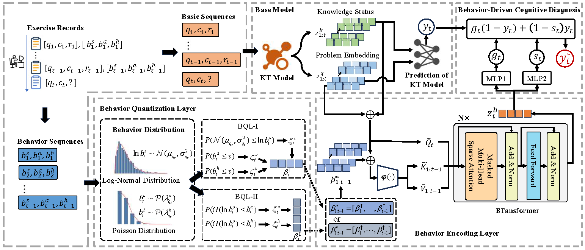

# Learning Behavior-Driven Knowledge Tracing Enhancement (LBE)

We propose LBE (Learning Behavior-Driven Knowledge Tracing Enhanced), a plug-and-play method for enhancing knowledge tracing through learning behavior analysis. This work focuses on characterizing and interpreting the relationship between learning behaviors and knowledge mastery

The behavioral sequence incorporates three types of learning behaviors: answering time, number of attempts, and number of hints. Here, the *KT Model* in the Base Model refers to existing knowledge tracing models.

## Experiment Result
The overall performance comparison on three real-world datasets. Best results in bold. $^{\uparrow}$  indicates performance improved with LBE compared to the baseline. Baseline represents the base model $\mathcal{M}$ using LBE.

|      |    Datasets      | Assist09 |         |         | Assist12 |         |         |  Junyi  |         |         |
| :----------: | :------: | :------: | :-----: | :-----: | :------: | :-----: | :-----: | :-----: | :-----: | :-----: |
|    Models    |          |   AUC    |   ACC   |  RMSE   |   AUC    |   ACC   |  RMSE   |   AUC   |   ACC   |  RMSE   |
|  LBKT(2023)  |          | 0.77060  | 0.73782 | 0.42240 | 0.77519  | 0.75643 | 0.40859 | 0.79317 | 0.85309 | 0.33384 |
|  DKT (2015)  | baseline | 0.75454  | 0.73104 | 0.42586 | 0.73008  | 0.73505 | 0.42429 | 0.74878 | 0.84632 | 0.34421 |
|              |  LBE-I   | 0.76836↑ | 0.73551↑ | 0.42233↑ | 0.76355↑  | 0.74850↑ | 0.41379↑ | 0.79947↑ | 0.85659↑ | 0.32979↑ |
|              |  LBE-II  | 0.77741↑ | 0.73877↑ | 0.42024↑ | 0.76551↑  | 0.74912↑ | 0.41317↑ | 0.79897↑ | 0.85592↑ | 0.32998↑ |
| DKVMN (2017) | baseline | 0.75091  | 0.73009 | 0.42723 | 0.72851  | 0.73428 | 0.42477 | 0.74758 | 0.84693 | 0.34382 |
|              |  LBE-I   | 0.76978↑  | 0.73852↑ | 0.42168↑ | 0.76721↑ | 0.75065↑ | 0.41340↑ | **0.80425**↑ | **0.85728**↑ | **0.32881**↑ |
|              |  LBE-II  | 0.76779↑  | 0.73617↑ | 0.42488↑ | 0.76385↑  | 0.74912↑ | 0.41398↑ | 0.80326↑ | 0.85708↑ | 0.32907↑ |
|  GKT (2019)  | baseline | 0.75601  | 0.73184 | 0.42585 | 0.73334  | 0.73470 | 0.42400 | 0.75167 | 0.84748 | 0.34293 |
|              |  LBE-I   | 0.76456↑  | 0.73256↑ | 0.42333↑ | 0.77225↑  | 0.75331↑ | 0.41101↑ | <u>0.80421</u>↑ | <u>0.85712</u>↑ | <u>0.32890</u>↑ |
|              |  LBE-II  | 0.76874↑  | 0.73582↑ | 0.42432↑ | 0.77139↑  | 0.75126↑ | 0.41180↑ | 0.80334↑ | 0.85684↑ | 0.32915↑ |
| SAKT (2019)  | baseline | 0.73217  | 0.71823 | 0.43491 | 0.71384  | 0.72837 | 0.42984 | 0.74654 | 0.84573 | 0.34519 |
|              |  LBE-I   | 0.75341↑  | 0.72819↑ | 0.43055↑ | 0.75404↑  | 0.74403↑ | 0.41777↑ | 0.80058↑ | 0.85586↑ | 0.33045↑ |
|              |  LBE-II  | 0.76524↑  | 0.73364↑ | 0.42701↑ | 0.75492↑  | 0.74469↑ | 0.41824↑ | 0.80049↑ | 0.85565↑ | 0.33095↑ |
|  AKT (2020)  | baseline | 0.77939  | 0.74141 | 0.42249 | 0.77620  | 0.75568 | 0.40963 | 0.79103 | 0.85125 | 0.33383 |
|              |  LBE-I   | 0.79007↑  | **0.75168**↑ | 0.41453↑ | **0.78350**↑ | **0.76113**↑ | 0.40630↑ | 0.80012↑ | 0.85619↑ | 0.33002↑ |
|              |  LBE-II  | 0.79005↑  |    0.74956↑     | 0.41479↑ | 0.78120↑  | 0.75949↑ | 0.40719↑ | 0.80029↑ | 0.85599↑ | 0.33018↑ |
| MIKT (2024)  | baseline | 0.78670  | 0.74771 | 0.41437 | 0.77891  | 0.75855 | 0.40719 | 0.79582 | 0.85381 | 0.33239 |
|              |  LBE-I   | <u>0.79156</u>↑ | 0.75072↑ | **0.41214**↑ | <u>0.78314</u>↑ | <u>0.76048</u>↑ | **0.40583**↑ | 0.79785↑ | 0.85582↑ | 0.33070↑ |
|              |  LBE-II  | **0.79175**↑ | <u>0.75079</u>↑ | <u>0.41265</u>↑ | 0.78157↑  | 0.75975↑ | <u>0.40610</u>↑ | 0.80035↑ | 0.85625↑ | 0.32994↑ |

where we denote the proposed LBE framework based on BQL-I as LBE-I and that based on BQL-II as LBE-II. 

